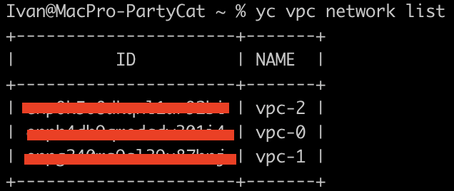
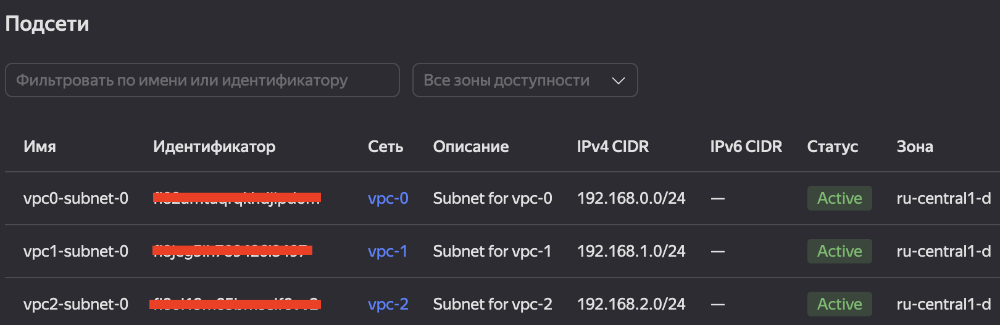
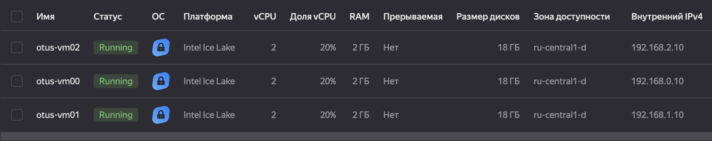
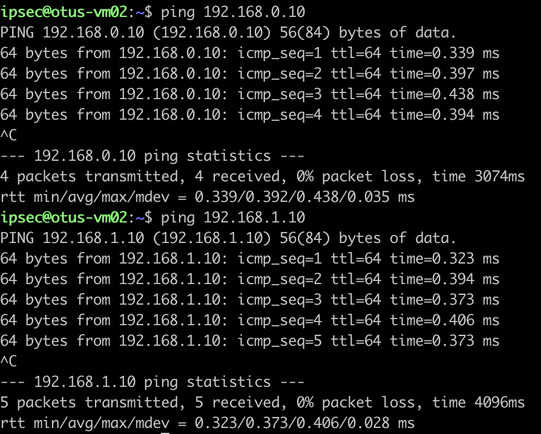
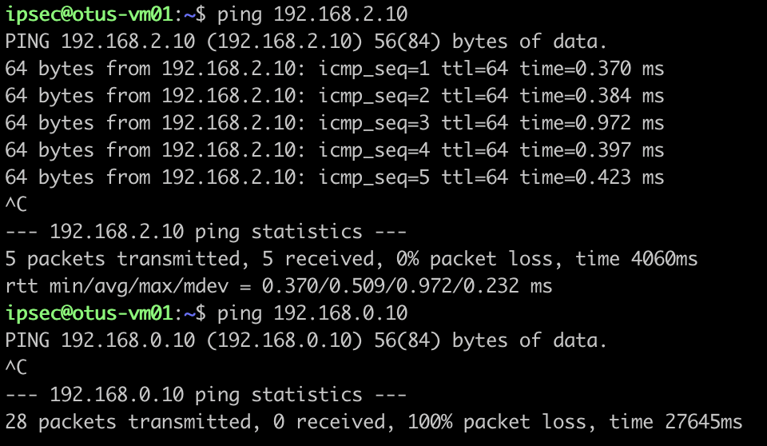
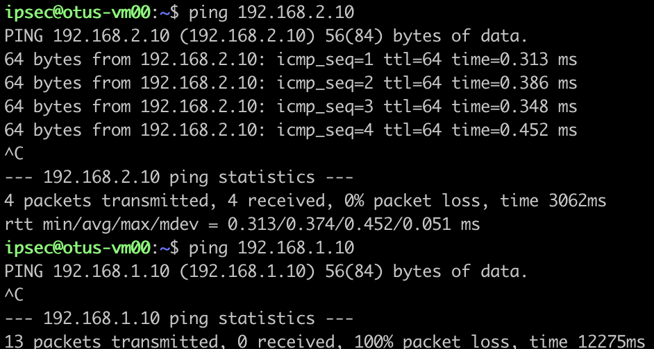

# Создание VPC
Изначально просто создаем в Yandex Cloud 3 VPC.

Квоты не позволяют сразу создать 3 VPC, для исправления этого нюанса формируется автоматически запрос в тех под. 
Ответили достаточно оперативно, никаких вопросов с созданием VPC не возникло.



В каждой VPC создаем по 1 подсети.



# Создание ВМ
Создадим 3 ВМ в каждой VPC и настроим ipsec туннели до каждой сети.
Туннели необходимы для связности сетей, VPC Peering нету в YC.

Будем использовать IPSec с использованием демона strongSwan.

У Yandex Cloud уже есть готовый инстанс с контейнером strongSwan на борту, поэтому разворачиваем 3 ВМ из готового образа.

Затем необходимо настроить каждый конфиг strongSwan.

```bash
# otus-vm00
connections {
  cloud-ipsec {
    local_addrs = 192.168.0.10
    remote_addrs = <external ip otus-vm02>
    local {
      auth = psk
    }
    remote {
      auth = psk
    }
    version = 2 # IKEv2
    mobike = no
    proposals = aes128gcm16-prfsha256-ecp256, default
    dpd_delay = 10s
    children {
      cloud-ipsec {
        # List of local IPv4 subnets
        local_ts = 192.168.0.0/24

        # List of remote IPv4 subnets
        remote_ts = 192.168.2.0/24

        start_action = trap
        esp_proposals = aes128gcm16
        dpd_action = clear
      }
    }
  }
}

# Pre-shared key (PSK) for IPsec connection
secrets {
  ike-cloud-ipsec {
    secret = ipsec-otus
  }
}
```

```bash
# otus-vm01
connections {
  cloud-ipsec {
    local_addrs = 192.168.1.10
    remote_addrs = <external ip otus-vm02>
    local {
      auth = psk
    }
    remote {
      auth = psk
    }
    version = 2 # IKEv2
    mobike = no
    proposals = aes128gcm16-prfsha256-ecp256, default
    dpd_delay = 10s
    children {
      cloud-ipsec {
        # List of local IPv4 subnets
        local_ts = 192.168.1.0/24

        # List of remote IPv4 subnets
        remote_ts = 192.168.2.0/24

        start_action = trap
        esp_proposals = aes128gcm16
        dpd_action = clear
      }
    }
  }
}

# Pre-shared key (PSK) for IPsec connection
secrets {
  ike-cloud-ipsec {
    secret = ipsec-otus
  }
}
```

```bash
# otus-vm02
connections {
  cloud-ipsec {
    local_addrs = 192.168.2.10
    remote_addrs = <external ip otus-vm00>
    local {
      auth = psk
    }
    remote {
      auth = psk
    }
    version = 2 # IKEv2
    mobike = no
    proposals = aes128gcm16-prfsha256-ecp256, default
    dpd_delay = 10s
    children {
      cloud-ipsec {
        # List of local IPv4 subnets
        local_ts = 192.168.2.0/24

        # List of remote IPv4 subnets
        remote_ts = 192.168.0.0/24

        start_action = trap
        esp_proposals = aes128gcm16
        dpd_action = clear
      }
    }
  }
  cloud-ipsec2 {
    local_addrs = 192.168.2.10
    remote_addrs = <external ip otus-vm01>
    local {
      auth = psk
    }
    remote {
      auth = psk
    }
    version = 2 # IKEv2
    mobike = no
    proposals = aes128gcm16-prfsha256-ecp256, default
    dpd_delay = 10s
    children {
      cloud-ipsec {
        # List of local IPv4 subnets
        local_ts = 192.168.2.0/24

        # List of remote IPv4 subnets
        remote_ts = 192.168.1.0/24

        start_action = trap
        esp_proposals = aes128gcm16
        dpd_action = clear
      }
    }
  }
}

# Pre-shared key (PSK) for IPsec connection
secrets {
  ike-cloud-ipsec {
    secret = ipsec-otus
  }
}

```



# Проверка работоспособности

### Пингуем с otus-vm02 (VPC-2 -> VPC-0, VPC-2 -> VPC-1)


### Пингуем с otus-vm01 (VPC-1 -> VPC-2, VPC-1 -> VPC-0)


### Пингуем с otus-vm00 (VPC-0 -> VPC-2, VPC-0 -> VPC-1)


# Полезные материалы по заданию
- https://drive.google.com/file/d/1xai7j8YDVnt31B6GZaSes9yDXnfJ5dwp/view
- https://cloud.yandex.ru/ru/docs/tutorials/routing/ipsec/
- https://cloud.yandex.ru/ru/docs/tutorials/routing/ipsec/ipsec-vpn#setup-cloud-vms
