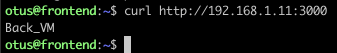
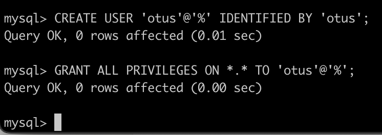
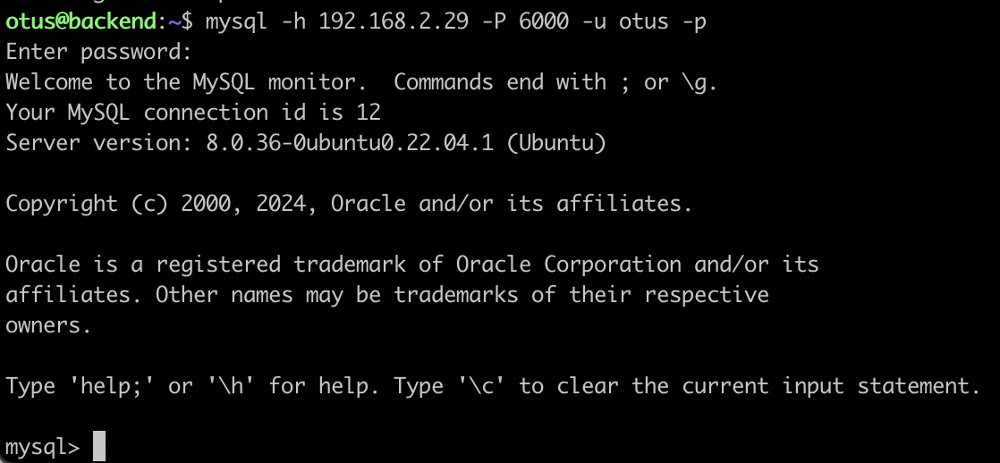

# Создание инфраструктуры

## Подготавливать инфраструктуру будем через Terraform

- Создаем 1 VPC
- Создаем 3 подсети
- Создаем 3 группы безопасности
- Создаем 3 виртуальные машины

Каждую группу безопасности мы привязываем к интерфейсу виртуальной машины

В качестве веб сервера выступаем nginx.
В качестве базы данных - MYSQL

Порты:
- front: 80
- back: 3000
- db mysql: 6000

## Проверим работоспособность и доступность

### Front VM
```bash
curl http://158.160.158.156:80/
```


### Back VM
Проверяем доступность с front vm:
```bash
curl http://192.168.1.11:3000
```



### DB VM
Создаем в MYSQL пользователя для подключения

```bash
CREATE USER 'otus'@'%' IDENTIFIED BY 'otus';
GRANT ALL PRIVILEGES ON *.* TO 'otus'@'%';
```


Теперь пробуем с бэкенда подключиться к базе:
```bash
mysql -h 192.168.2.29 -P 6000 -u otus -p
```


# Полезные материалы по заданию
- https://cdn.otus.ru/media/public/d3/5f/otus_sem_3_compute_and_networking_50d0d0_185248_c0942e_287690_e05e73-267409-d35fab.pdf
- https://www.digitalocean.com/community/tutorials/how-to-install-mysql-on-ubuntu-20-04
- https://terraform-provider.yandexcloud.net//Resources/compute_instance

