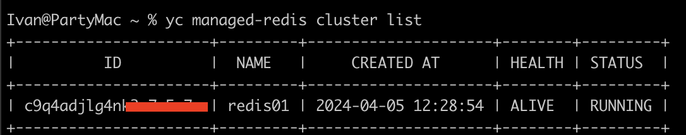
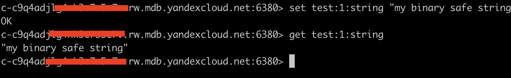

# Создание инфраструктуры

## Подготавливать инфраструктуру будем через Terraform

- Создаем 1 VPC
- Создаем 1 подсеть
- Создаем 2 виртуальные машины
- Создаем 3 диска (HDD, SSD, NRSSD) и файловое хранилище
- Создаем кластер Redis

К виртуальным машинам сразу подключаем созданные диски и хранилище, ну и создаем разделы через cloud-init.
По итогу получаем разделы:


Проверяем, что на 2 ВМ тоже подключилось файловое хранилище (fsdisk):


Проверяем, что файловое хранилище работает и данные доступны на обоих ВМ:


Для подключения к кластру Redis сперва получаем сертификат
```bash
mkdir -p ~/.redis && \
wget "https://storage.yandexcloud.net/cloud-certs/CA.pem" \
     --output-document ~/.redis/YandexInternalRootCA.crt && \
chmod 0655 ~/.redis/YandexInternalRootCA.crt
```

Проверяем что кластер создался:



Подключаемся к кластеру:
```bash
redis-cli -h c-c9q4adj************.rw.mdb.yandexcloud.net \
  -p 6380 \
  --tls \
  --cacert ~/.redis/YandexInternalRootCA.crt \
  -a "****"
```



# Полезные материалы по заданию
- https://terraform-provider.yandexcloud.net/Resources/compute_disk
- https://terraform-provider.yandexcloud.net/Resources/compute_instance
- https://habr.com/ru/articles/204354/
- https://yandex.cloud/ru/docs/managed-redis/operations/connect/non-sharded
- https://yandex.cloud/ru/docs/managed-redis/operations/cluster-create#tf_3

