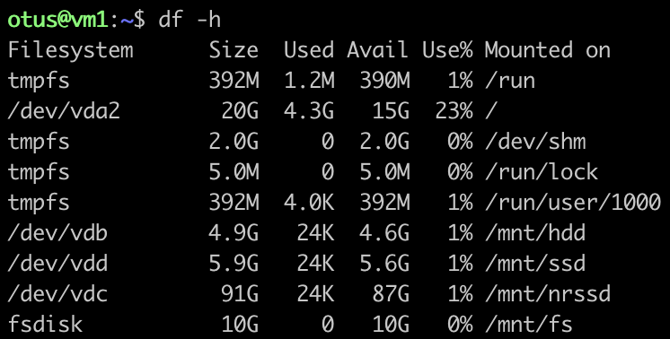
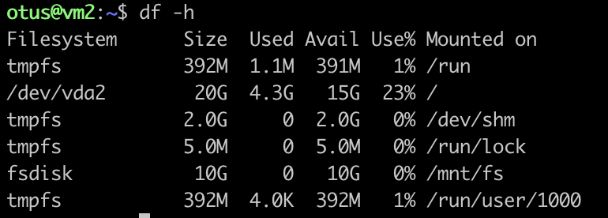
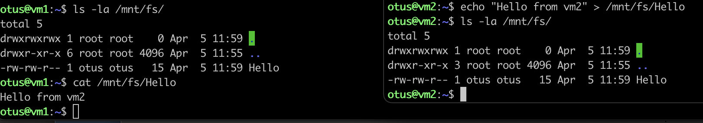

# Создание инфраструктуры

## Подготавливать инфраструктуру будем через Terraform

- Создаем 1 VPC
- Создаем 1 подсеть
- Создаем 2 виртуальные машины
- Создаем 3 диска (HDD, SSD, NRSSD) и файловое хранилище

К виртуальным машинам сразу подключаем созданные диски и хранилище, ну и создаем разделы через cloud-init.
По итогу получаем разделы:

Проверяем, что на 2 ВМ тоже подключилось файловое хранилище (fsdisk):

Проверяем, что файловое хранилище работает и данные доступны на обоих ВМ:

# Полезные материалы по заданию
- https://terraform-provider.yandexcloud.net/Resources/compute_disk
- 

