# Jump host
Для начала создадим в облаке jump host на Ubuntu, на котором развернем docker.

Виртуалку подготовим с помощью Terraform.

Затем создадим кастомный image с помощью докер файла:

```bash
FROM nginx:latest
COPY index.html /usr/share/nginx/html/index.html
```
```bash
docker build -t otusnginx .
```

Затем запускаем контейнер и проверяем работу:
```bash
docker run -d -p 80:80 otusnginx
docker ps
```
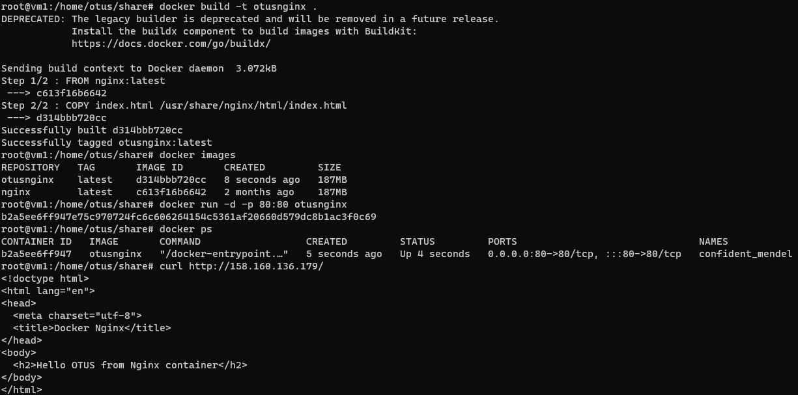

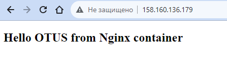

Затем создаем новый Container Registry и загружаем в него наш собранный image:

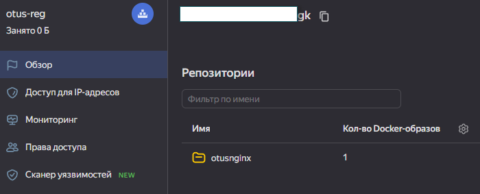


Теперь переходим к Serverless Containers.
Развернем сам контейнер и в запустим несколько ревизий:

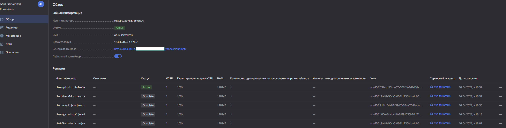

Ну и конечно проверим работоспособность:

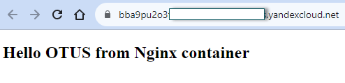

Теперь поднимем решение Container Solution.

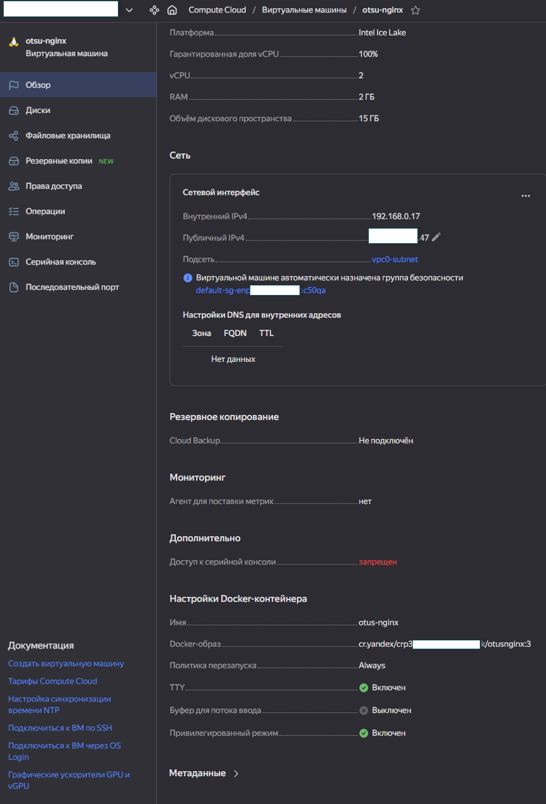

Ну и традиционная его проверка:

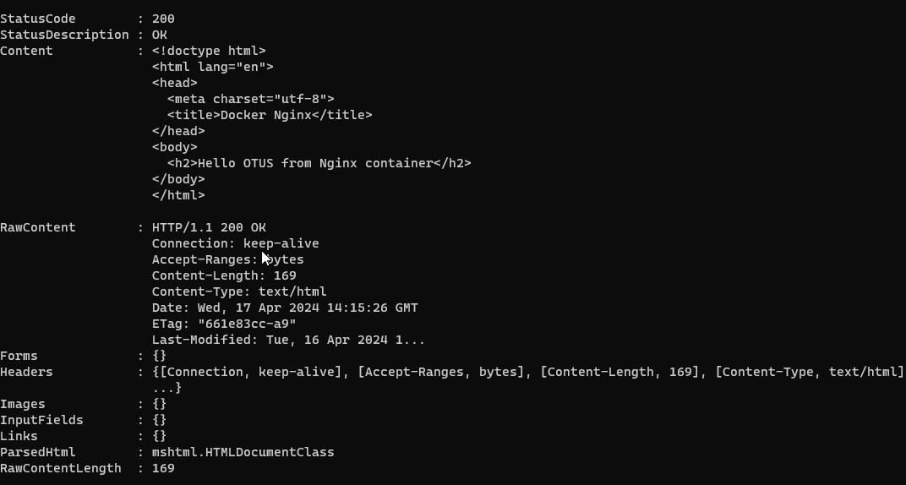

Затем поднимаем k8s:

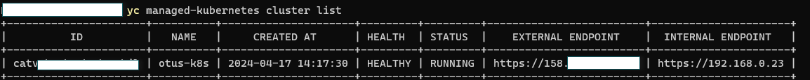

Создаем внутри группу узлов:

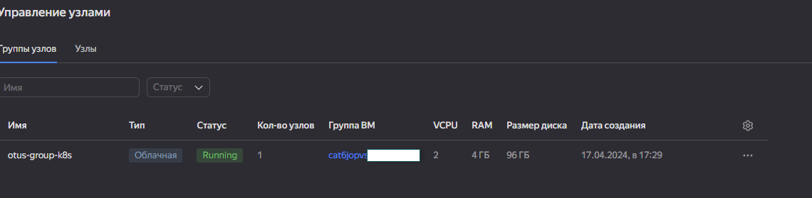

Создаем деплоймент nginx:
```bash
apiVersion: apps/v1
kind: Deployment
metadata:
  name: nginx-deployment
  labels:
    app: nginx
spec:
  replicas: 1
  selector:
    matchLabels:
      app: nginx
  template:
    metadata:
      labels:
        app: nginx
    spec:
      containers:
      - name: nginx
        image: nginx:1.14.2
        ports:
        - containerPort: 80
```
Проверяем, что под работает:

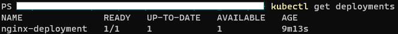

Теперь создаем сервис load-balancer:

```bash
apiVersion: v1
kind: Service
metadata:
  name: hello
spec:
  type: LoadBalancer
  ports:
  - port: 80
    name: plaintext
    targetPort: 80
  selector:
    app: nginx
```

Проверяем что работает:

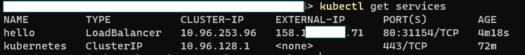

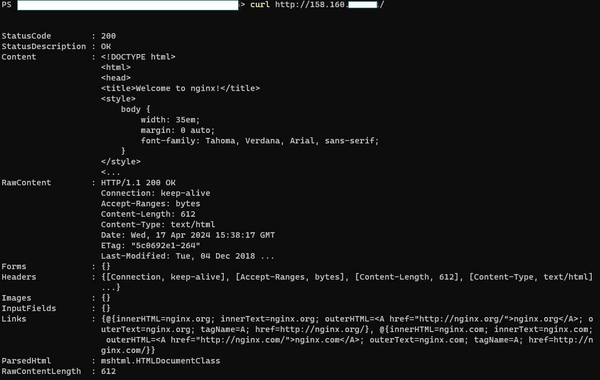