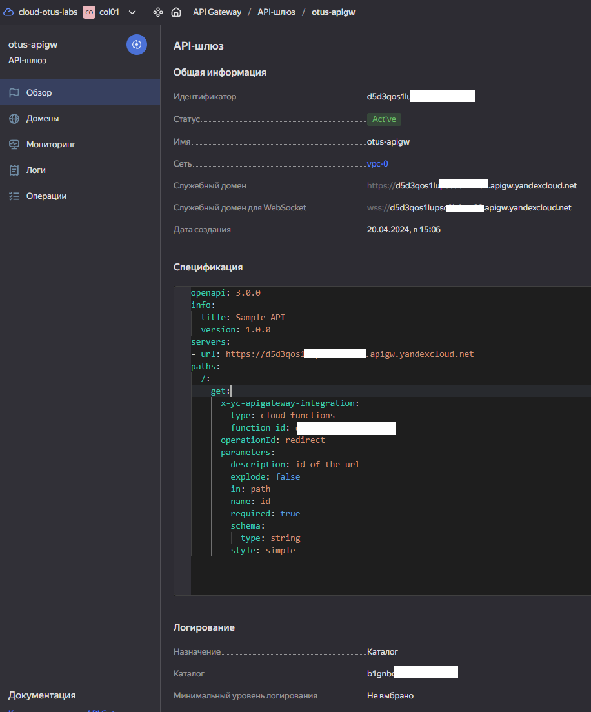
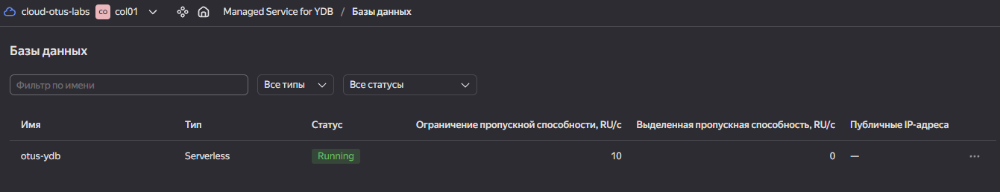
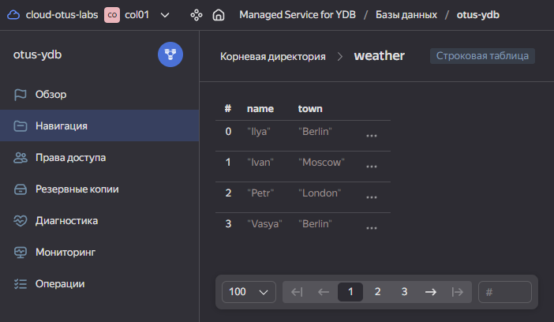

# Сперва создаем функцию 01
Эта функция будет принимать запрос от API GW, записывать данные в YDB и отправлять запрос во 2 функцию.<br>
Ее спецификация:
```bash
import requests
import urllib.parse
import hashlib
import base64
import json
import os
import ydb
import ydb.iam

def execute_query(session, name, town):
    query = f"INSERT INTO weather (name, town) VALUES ('{name}', '{town}');"
    return session.transaction().execute(
        query,
        commit_tx=True,
        settings=ydb.BaseRequestSettings().with_timeout(3).with_operation_timeout(2)
    )

def handler(event, context):
    name = event['queryStringParameters']['name']
    town = event['queryStringParameters']['town']
    
    driver = ydb.Driver(
        endpoint=os.getenv('YDB_ENDPOINT'),
        database=os.getenv('YDB_DATABASE'),
        credentials=ydb.iam.MetadataUrlCredentials(),
    )
    driver.wait(fail_fast=True, timeout=5)

    pool = ydb.SessionPool(driver)

    def wrapped_execute_query(session):
        return execute_query(session, name, town)

    pool.retry_operation_sync(wrapped_execute_query)
    
    other_function_url = 'https://functions.yandexcloud.net/d4eqv8uo9vt44o84hvom' 
    payload = {
        'name': name,
        'town': town
    }
    response = requests.post(other_function_url, json=payload)
    
    if response.status_code == 200:
        return {
            'statusCode': 200,
            'body': response.json()
        }
    else:
        return {
            'statusCode': 500,
            'body': 'Error calling other function'
        }
```
Также к функции 1 мы добавляем файл requirements.txt:
```bash
ydb
```


# Создаем API Gateway
Не забываем передавать ID нашей первой функции в него

```bash
openapi: 3.0.0
info:
  title: Sample API
  version: 1.0.0
paths:
  /:
    get:
      x-yc-apigateway-integration:
        type: cloud_functions
        function_id: <ID fn01>
      operationId: redirect
      parameters:
      - description: id of the url
        explode: false
        in: path
        name: id
        required: true
        schema:
          type: string
        style: simple

```


# Создаем базу данных YDB

```bash
CREATE TABLE weather
(
   name Utf8,
   town Utf8,
   PRIMARY KEY (name)
);
```



# Вторая функция fn02
Эта функция принимает параметры от первой, делает запрос погоды и передает в первую json ответ:
```bash
import json
import requests

def handler(event, context):
    api_key = <API key>
    
    # Получение параметров name и town из запроса
    request_body = json.loads(event['body'])
    name = request_body['name']
    town = request_body['town']
    
    url = f'http://api.weatherapi.com/v1/current.json?key={api_key}&q={town}'
    
    response = requests.get(url)
    if response.status_code == 200:
        weather_data = response.json()
        # Добавление параметра name в ответ
        weather_data['name'] = name
        return {
            'statusCode': 200,
            'body': json.dumps(weather_data)
        }
    else:
        return {
            'statusCode': response.status_code,
            'body': json.dumps({'error': 'Error fetching weather data'})
        }
```


# Полезные материалы

- https://github.com/golodnyj?tab=repositories
- https://www.weatherapi.com/docs/
- https://yandex.cloud/ru/docs/functions/
- https://terraform-provider.yandexcloud.net/Resources/function

