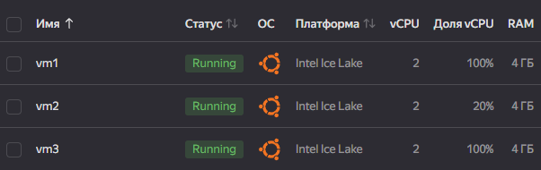
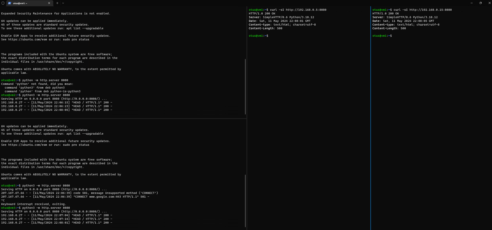
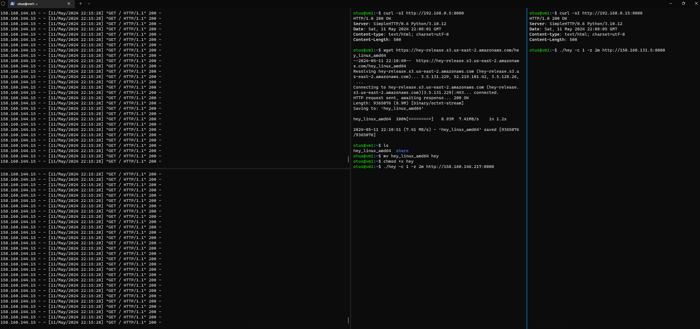
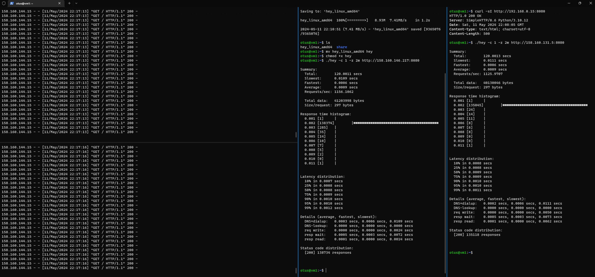

# Ход выполнения задания

Мы попробуем провести нагрузочная тестирование в Yandex.Cloud.<br>
Для этого мы поднимем 3 Вмки, 1 jump-host и 2 ВМки, которые мы будем нагружать.<br>
Разница между нагружаемыми ВМ будет в выдаваемых ресурсах. 1 из ВМ мы сделаем гарантированную долю vCPU не 100%, а 20%.<br>

Нагружать мы будем через https://github.com/rakyll/hey

Поднимать ВМ для лабораторной мы будем через Terraform.

vm1 - jumphost<br>
vm2 - ограниченная по vCPU до 20%<br>
vm3 - вм без ограничений vCPU



Поднимаем на vm2 / vm3 http server и проверяем с jump хоста, что сервер работает:


Ну а теперь начинаем с помощью hey нагрузочное тестирование обоих наших VM:

```bash
otus@vm1:~$ ./hey -c 1 -z 2m http://158.160.146.217:8080
```



По результатам тестирования видно, что кол-во запросов, которые отрабатывают чуть медленнее, больше на vm2 (ограниченная по vCPU до 20%)

