# Ход выполнения задания

## Настройка отказоустойчивой архитектуры в Yandex Cloud

### Подготовим контейнеры приложения TodoList

```bash
yc container registry configure-docker
yc container registry create --name todo-registry
docker build . --tag cr.yandex/<идентификатор_реестра>/todo-demo:v1 --platform linux/amd64
docker build . --build-arg COLOR_SCHEME=dark --tag cr.yandex/<идентификатор_реестра>/todo-demo:v2 --platform linux/amd64
```
Загрузим Docker-образы в Container Registry:

```bash
docker push cr.yandex/<идентификатор_реестра>/todo-demo:v1
docker push cr.yandex/<идентификатор_реестра>/todo-demo:v2
```
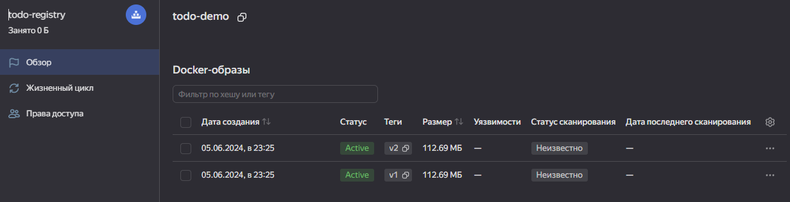

### Развернем инфраструктуру

Будут созданы следующие ресурсы:

- Сеть Virtual Private Cloud с тремя подсетями во всех зонах доступности.
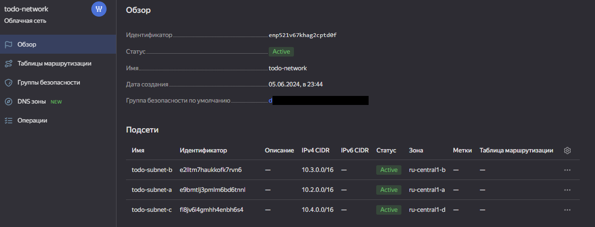
- Два сервисных аккаунта:
  - Сервисный аккаунт для управления группой ВМ с ролью editor. 
  - Сервисный аккаунт для скачивания Docker-образа на ВМ с ролью container-registry.images.puller.
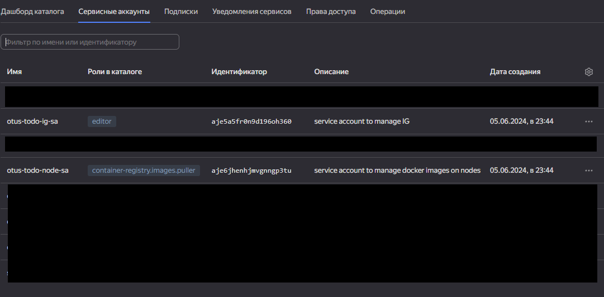
- Группа ВМ из четырех ВМ на базе Container Optimized Image в зонах доступности ru-central1-b и ru-central1-d.
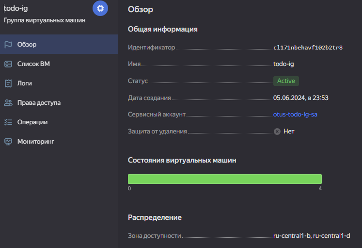
- Кластер Managed Service for PostgreSQL с двумя хостами в зонах доступности ru-central1-b и ru-central1-d.
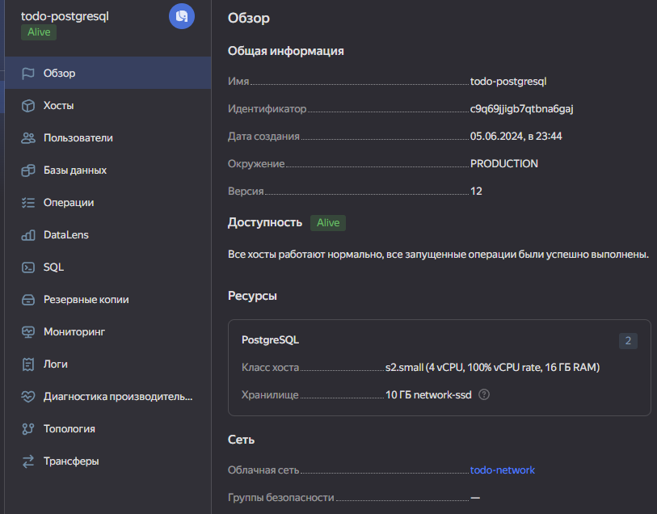
- Сетевой балансировщик нагрузки для распределения трафика по ВМ группы.
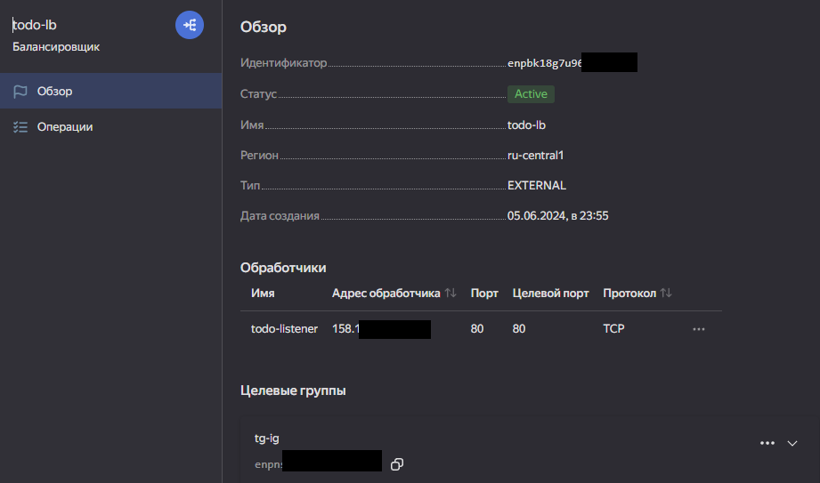

Проверяем работу приложения:<br>
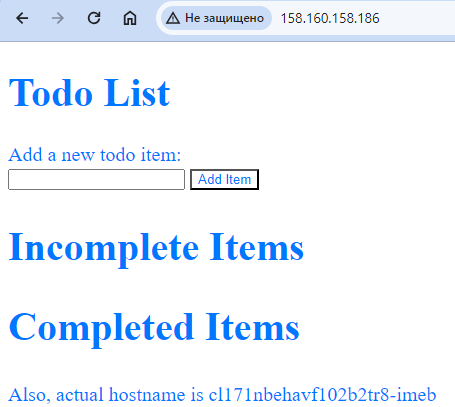

## Выполнение сценариев

### Сбой ВМ

Как проявляется сбой: недоступна ВМ с приложением.

Возможные причины:

Падение физического хоста, на котором была запущена ВМ.
По ошибке удалена ВМ с приложением.

Для имитации сбоя удалим одну из ВМ группы.

Реакция тестового стенда:

1. Сетевой балансировщик нагрузки и Instance Groups получают информацию о сбое ВМ и выводят ее из балансировки — трафик перестает поступать на эту ВМ и распределяется между оставшимися ВМ в группе.<br>
2. Instance Groups автоматически восстанавливается: <br>
   - Удаляет недоступную ВМ (в этом сценарии ВМ уже удалена, шаг будет пропущен).
   - Создает новую ВМ.
   - Ожидает запуска приложения на созданной ВМ.
   - Добавляет ВМ в балансировку.
После выведения недоступной ВМ из балансировки пользовательская нагрузка обрабатывается корректно.
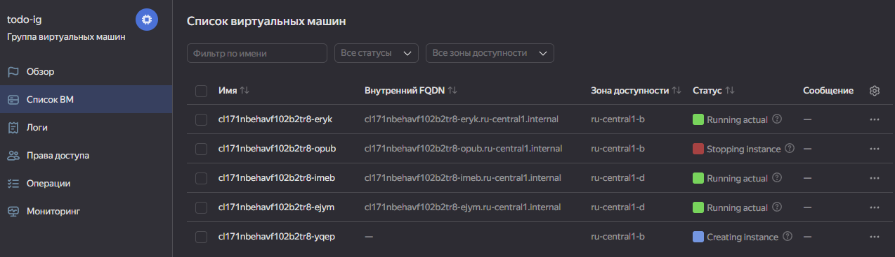
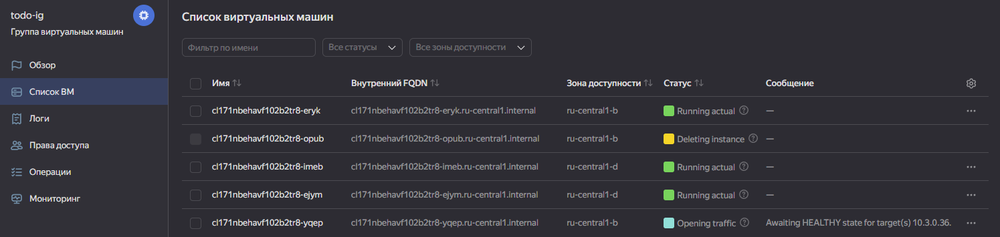
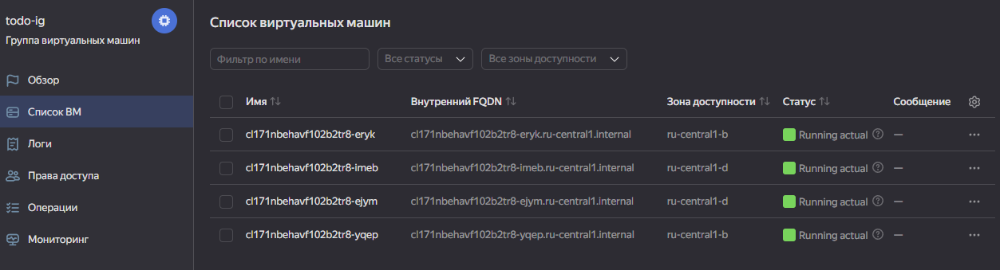

### Отключение зоны доступности

Как проявляется сбой: недоступны несколько ВМ в одной зоне.

Возможные причины:

Перебои в работе дата-центра.<br>
Плановые технические работы в дата-центре.

Реакция тестового стенда:

1. Instance Groups выводит из балансировки ВМ в зоне доступности ru-central1-b.
2. Выведенные ВМ удаляются, одновременно с этим создаются ВМ в зоне ru-central1-d.
3. Instance Groups добавляет созданные ВМ в балансировку.

После выведения ВМ из балансировки пользовательская нагрузка обрабатывается корректно.
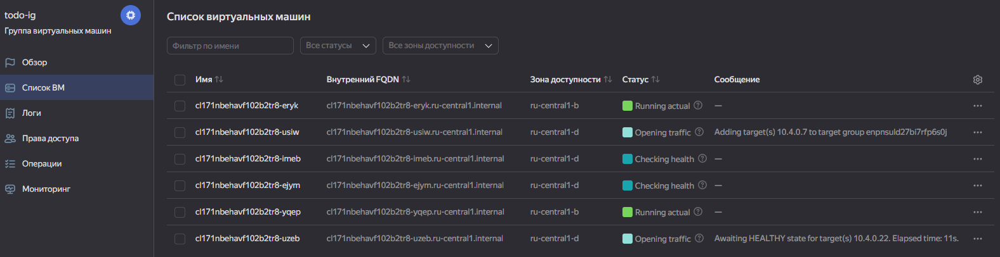
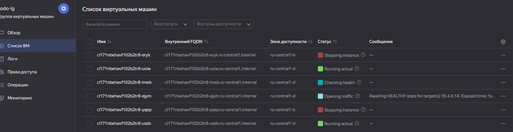
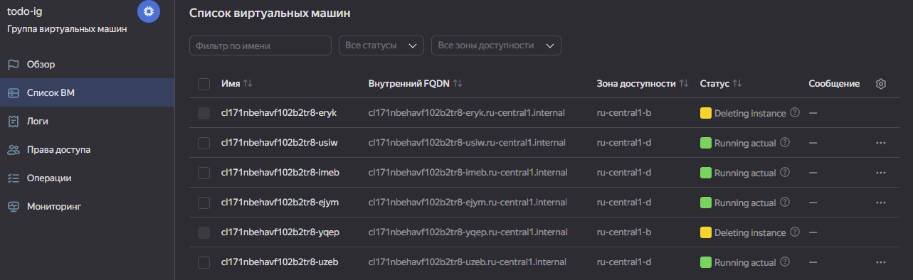
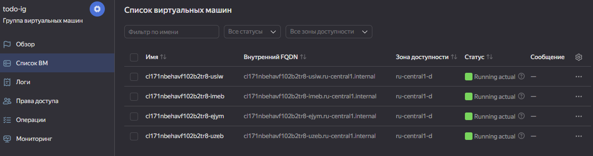