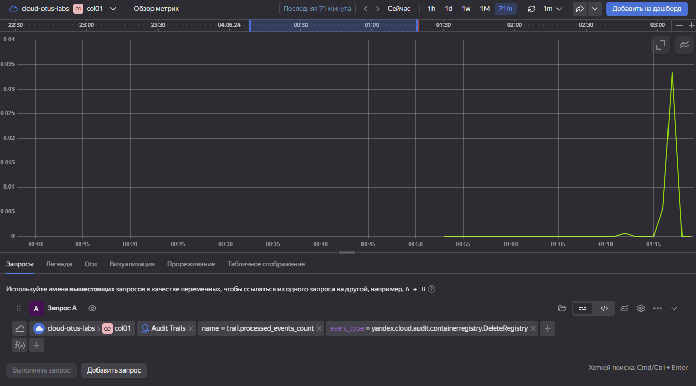

# Ход работы

В качестве примера на изучим инструмент Yandex Trails.<br>
Настроим его и попробуем отследить события безопасности.

Дла начала создадим сам Trail:


Настроим мониторинг самого сервиса Audit Trails:<br>
Audit Trails -> Зайдем в Monitoring<br>
Создадим Alert (Trails by status):


Для примера создадим alert на событие безопасности - удаление репозитория (yandex.cloud.audit.containerregistry.DeleteRepositor).

```bash
"trail.processed_events_count"{folderId="xxx", service="audit-trails", event_type="yandex.cloud.audit.containerregistry.DeleteRegistry"}
```

Удаляем репозиторий:


Ловим событие:


Таким образом можно отслеживать различные события через Yandex Trail и смотреть на дашборды в Monitoring.<br>
А также настраивать уведомления на различные метрики.<br>

Ну а также через Cloud Logging также можно отслеживать различные события:

