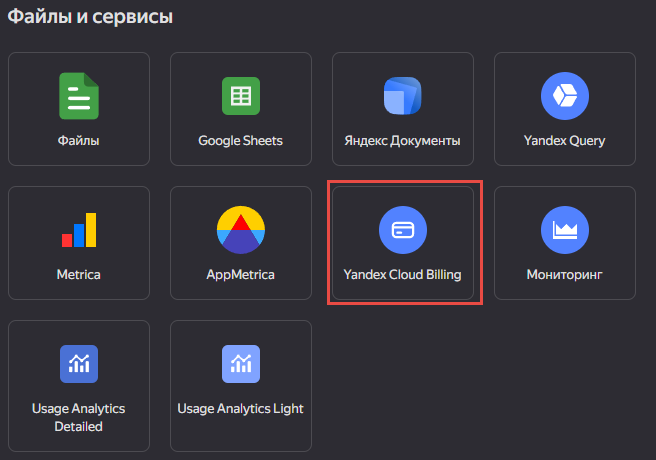
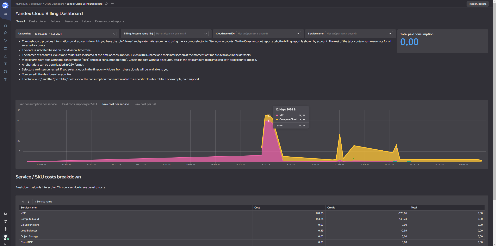
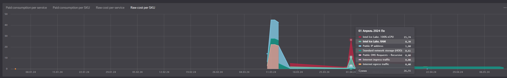
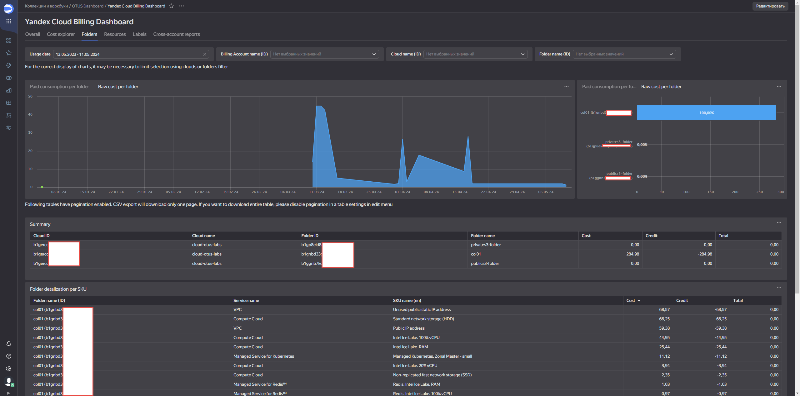
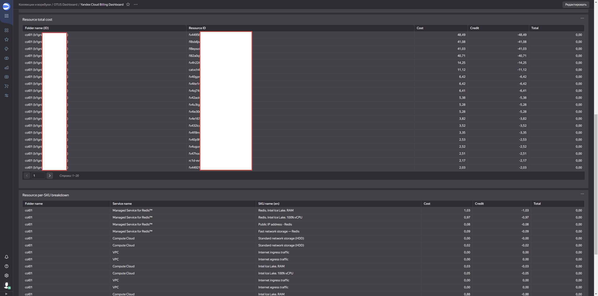
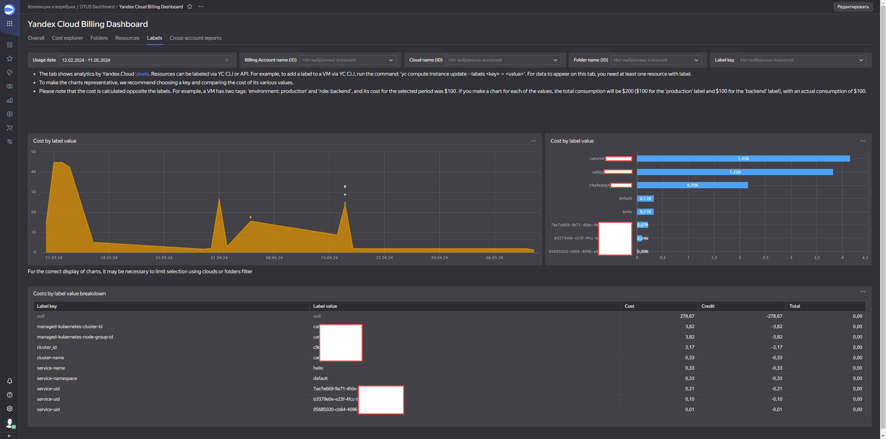

Создадим свой первый дашборд с чартами в Yandex Cloud Datalens: 

https://datalens.yandex.cloud/

Для этого создадим новое подключение к биллингу:

На главной странице мы видим общее представление о ресурсах и затратам в табличном виде подробнее внизу и в центре в виде графика по датам:

Вот еще более подробный график:

Далее есть вкладка, которая показывает детальную информацию по каталогам. 
В данном случае видно, что всего в облаке представлено 3 каталога, но только в одном происходят траты:

Еще один детальный отчет по ресурсам

Ну и наконец можно также построить отчет по тэгам \ меткам:
