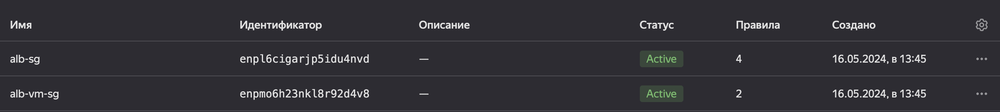

# Перенос web приложения в облако

Мы смигрируем web приложение в облако. 
Нагрузка будет распределяться между группой виртуальных машин. 
Также поднимем Application Load Balancer. 
Создавать ресурсы будем через Terraform.

План работ:
- [ ] Подготовим облако к работе. 
- Создаем сервисную учетную запись 
- Авторизуемся в облаке

- [ ] Подготовим сетевую инфраструктуру.
- Создадим 3 VPC в разных регионах(ru-central1-a, ru-central1-b, ru-central1-d)
- В каждой VPC создаем подсети

- [ ] Создадим группы безопасности.

- [ ] Создадим группу виртуальных машин.
- Создаем группу ВМ и 3 ВМ в разных регионах

- [ ] Загрузим файлы веб-сайта.
- На ВМ переносим файлы нашего приложения
- [ ] Создадим группу бэкендов.
- Группа бэкендов содержат настройки балансировки трафика и проверок состояния целевых ресурсов. 
- 
- [ ] Создадим HTTP-роутер.
- HTTP-роутеры определяют правила маршрутизации запросов к бэкендам и позволяют модифицировать запросы прямо на балансировщике.

- [ ] Создадим L7-балансировщик.
- Балансировщик принимает запросы и распределяет их по ВМ из целевой группы по правилам, указанным в HTTP-роутере.

- [ ] Настроим DNS.
