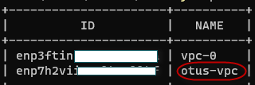
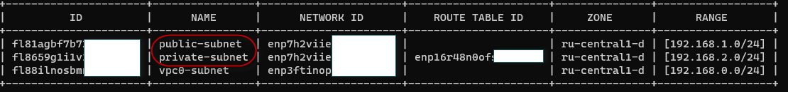
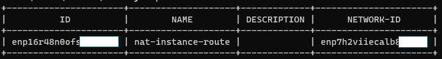
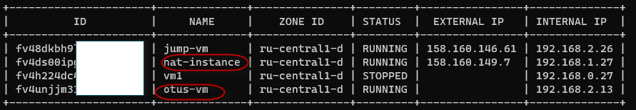
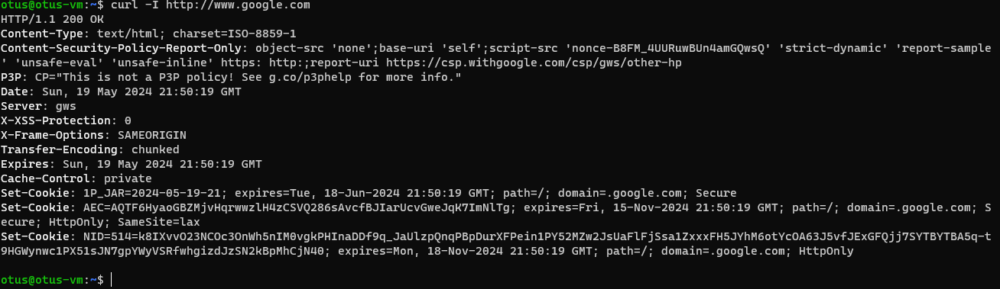

# Описание решения

В данном примере мы развернем VPC с 2мя подсетями, внутренней и внешней. 
Настроим таблицу маршрутизации. 
В данном примере ВМ из внутренней сети будет выходить в интернет через nat инстанс. Роутинг мы отдельно настроим. 

Создавать инфраструктуру будем через Terraform. 

Создаем новую VPC: 

Подсети: 

Таблицу маршрутизации:

Создаем 2 ВМ:

Подключаемся к otus-vm и проверяем ее работу:
