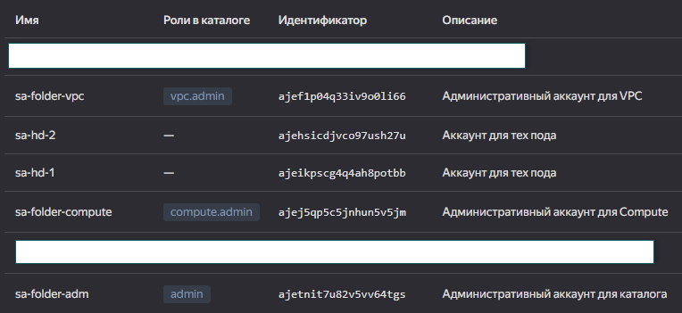
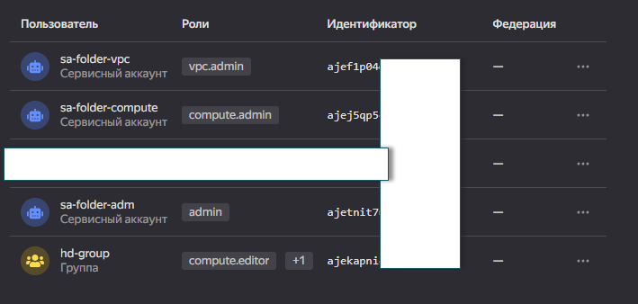
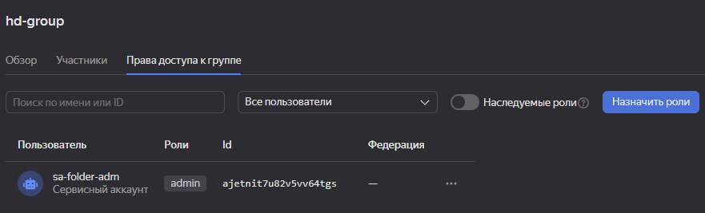
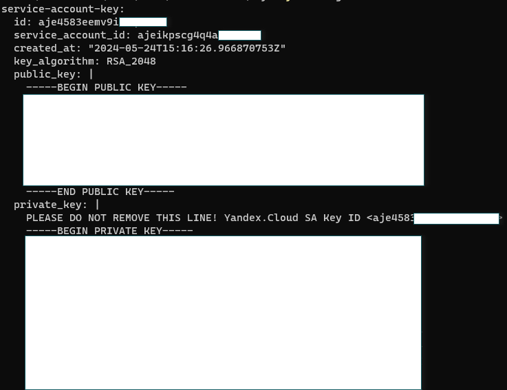
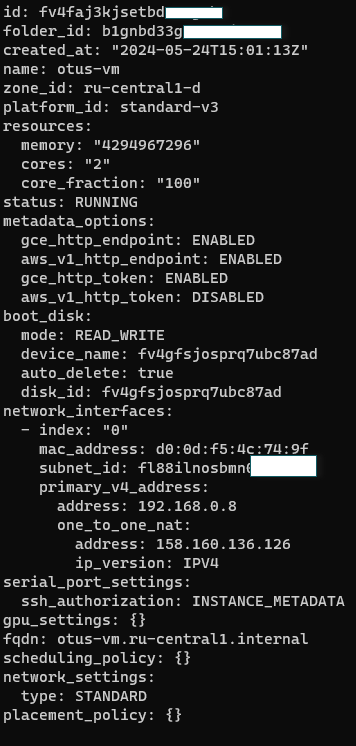

# Ход выполнения

Для начала создадим для каждого необходимого нам типа ресурсов отдельные сервисные аккаунты, а также админский аккаунт на каталог, с помощью которого будем ими управлять.<br>
Создадим сервисные аккаунты для:
- VPC
- Compute

Также создаем 2 учетки для тех поддержки. Объединим их в одну группу и выдадим на нее права.


Выдадим им необходимые роли для ресурсов. Исходим из того, что выдаем минимально необходимые привилегии:


Делегируем управление этими ролями административному аккаунту каталога:<br>


Проверим работу из под пользователя тех пода:

```
# Создадим авторизованный ключ для сервисного аккаунта и сохраним его в файл key.json
yc iam key create --service-account-name sa-hd-1 --output key.json --folder-id <ID_каталога>

# Создадим новый профиль CLI
yc config profile create sa-hd-1

# Добавим авторизованный ключ
yc config set service-account-key key.json

# Проверим, что параметры для сервисного аккаунта добавлены верно
yc config list
```


```
# Проверяем доступ к VM
yc compute instance get <ID VM>
```
