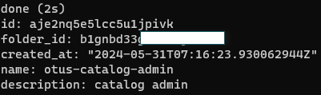
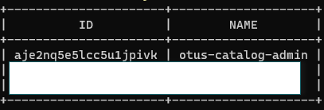
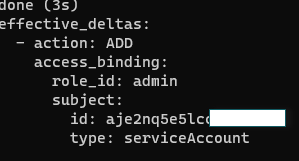
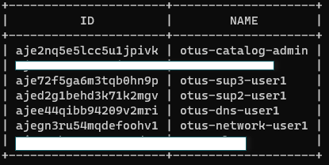
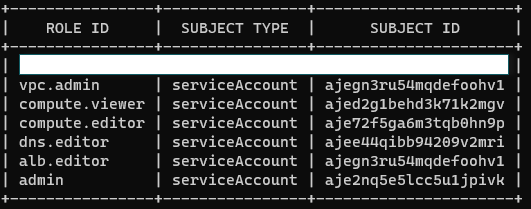

# Ход работы

В качестве доработки возьмем lab 13 (https://github.com/Torenok/OTUS_Labs/tree/main/13)

Добавим рутовый аккаунт, который будет управлять каталогом.
  - Этот аккаунт создает другие и не более
  - Логиниться под ним будем только в крайний случай нужды

```bash
yc iam service-account create otus-catalog-admin --description "catalog admin"
```


```bash
yc iam service-account list
```


```bash
yc resource-manager folder add-access-binding b1gnbd3**** --role admin --subject serviceAccount:aje2nq5e5lcc5u1jpivk
```


Создадим учетную запись для сетевиков, чтобы они могли управлять vpc, группами безопасности, балансировщиком и роутером.<br>
Создадим учетную запись для 2 линии тех пода, чтобы они могли видеть ВМки, но ничего не могли менять.<br>
Создадим учетную запись для 3 линии тех пода, чтобы они могли управлять ВМками.
Создадим учетную запись для управления DNS.

```bash
yc iam service-account create otus-network-user1 --description "for network support"
yc iam service-account create otus-sup2-user1 --description "for sup2"
yc iam service-account create otus-sup3-user1 --description "for sup3"
yc iam service-account create otus-dns-user1 --description "for dns"
```

```bash
yc iam service-account list
```


```bash
yc resource-manager folder add-access-binding b1gnbd3**** --role vpc.admin --subject serviceAccount:ajegn3ru54mqdefoohv1
yc resource-manager folder add-access-binding b1gnbd3**** --role alb.editor --subject serviceAccount:ajegn3ru54mqdefoohv1
yc resource-manager folder add-access-binding b1gnbd3**** --role compute.viewer --subject serviceAccount:ajed2g1behd3k71k2mgv
yc resource-manager folder add-access-binding b1gnbd3**** --role compute.editor --subject serviceAccount:aje72f5ga6m3tqb0hn9p
yc resource-manager folder add-access-binding b1gnbd3**** --role dns.editor --subject serviceAccount:ajee44qibb94209v2mri
```
Проверяем созданыне нами роли
```bash
yc resource-manager folder list-access-bindings b1gnbd3****
```


