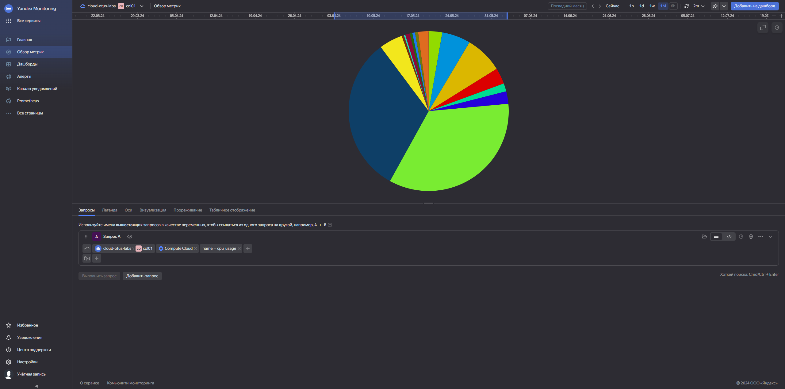
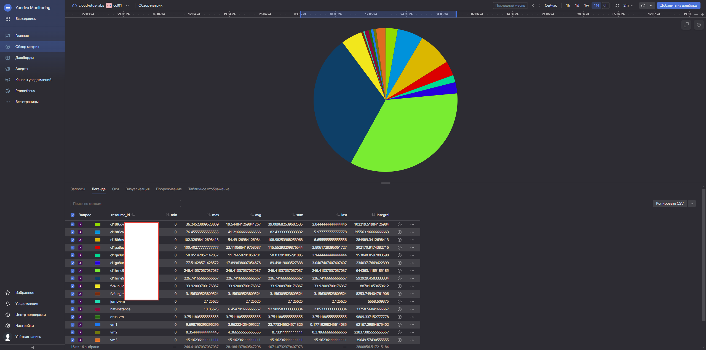
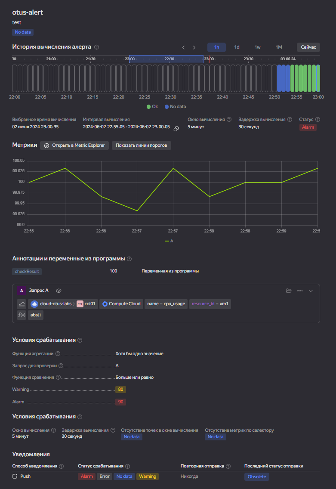

# Ход выполнения

Раз тема про мониторинг, попробуем получить различные исторические данные через Yandex Monitoring.

На странице метрик мы можем сформировать критерий \ запрос, по которому получим некий дашборд.<br>
Попробуем сформировароть график нагрузки CPU по инстансам.<br>
Можно сделать визуализацию в виде графика. а можно в виде кругой диаграммы:




Ну и проверим метрики на примере нагрузки на ВМ.

Ставим пакет stress:

```bash
sudo apt install stress -y
```

Запускаем нагрузку
```bash
sudo stress --cpu 2 --vm-bytes 256 --vm-keep -m 1
```

Создаем Alert. Указываем что Alert срабатывает при достижении пороговых значений в 80% и 90% нагрузки CPU.
