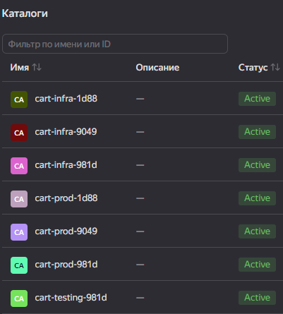
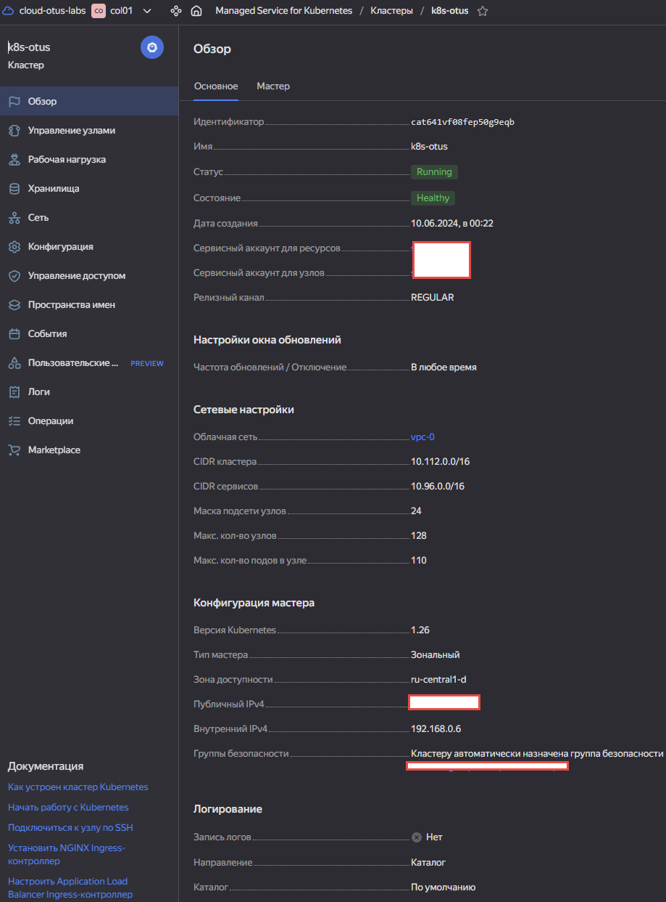
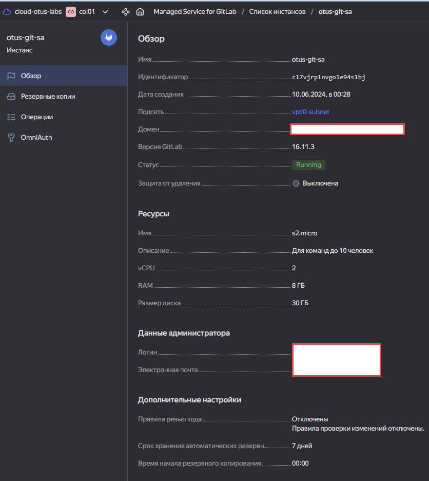
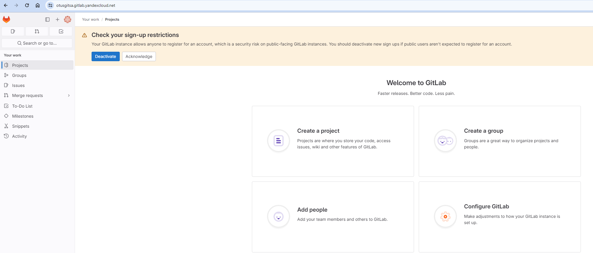
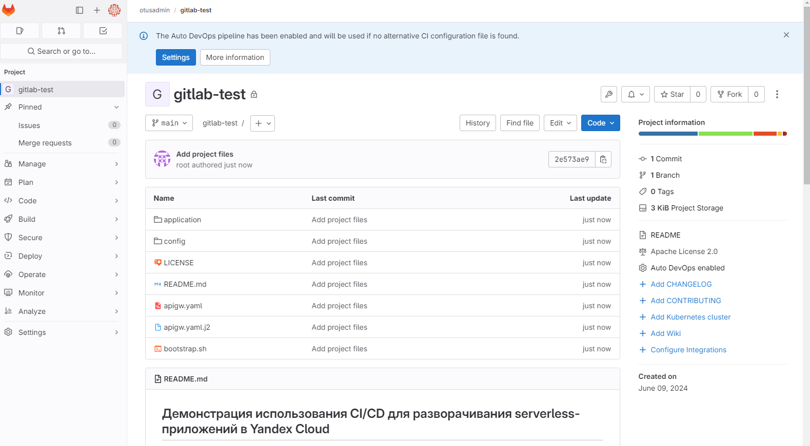
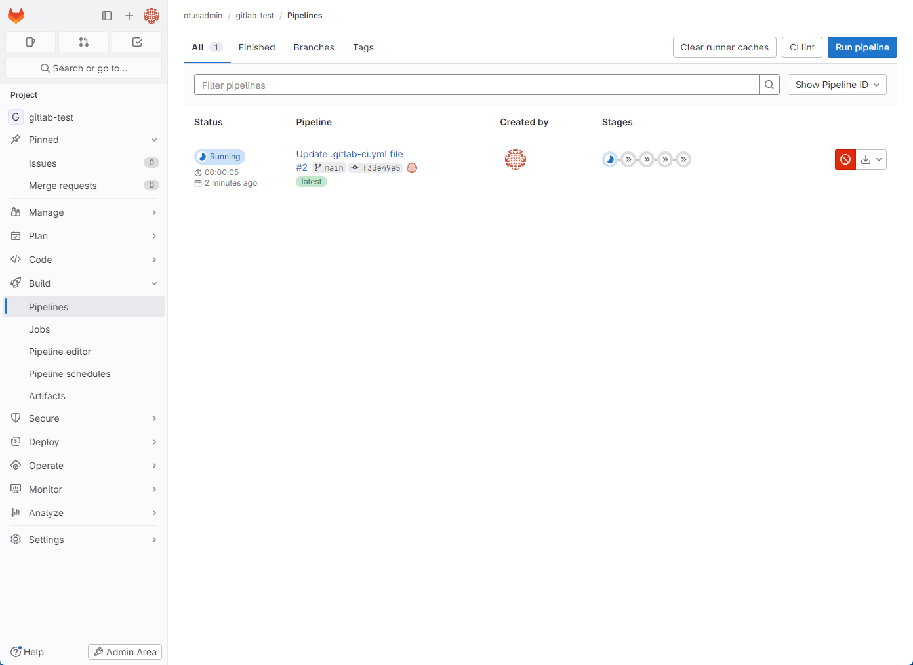

# Ход работы

В качестве примера проекта будет использовано веб-приложение, реализованное на Django, которое имитирует корзину товаров интернет-магазина. <br>

Для проекта используются два окружения:

- prod — продакшн, доступный пользователям.<br>
- testing — тестовое, используется для проверки приложения перед релизом в prod.

Для каждого из окружений создается отдельный каталог в Yandex Cloud, а так же отдельный набор статических ресурсов — БД, сервисные аккаунты и т. д. <br>
Таким образом все окружения изолированы друг от друга на уровне настроек Yandex Identity and Access Management.

Для начала установим:
- Интерфейс командной строки Yandex Cloud.
- Утилиту потоковой обработки JSON-файлов jq.
- Утилиту потоковой обработки YAML-файлов yq.
- Python версии 3.8 или выше.

Установим зависимости:
```bash
Django>=3.0,<4.0
dynamorm
marshmallow==2.21.0
cryptography>=3.3.1
yandexcloud
pyyaml
```
Подготовим инфру:
```bash
YC_CLOUD_ID=<идентификатор облака> ./bootstrap.sh
```




Создаем k8s кластер



Создаем инстанс GitLab:





Создаем новый проект, создаем Runner и клонируем себе проект через git clone.



Создаем переменные окружения GitLab:
- cloud_id — идентификатор нашего облака.
- CI_REGISTRY — идентификатор реестра Container Registry в каталоге infra с префиксом cr.yandex/.
- CI_REGISTRY_KEY — ключ сервисного аккаунта builder.
- cart_prod — имя продакшн каталога в Yandex Cloud.
- DOCAPI_ENDPOINT_prod — Document API эндпоинт БД Yandex Managed Service for YDB в каталоге prod.
- PROD_SA_ID — идентификатор сервисного аккаунта deployer в каталоге prod.
- SA_PROD_DEPLOYER_PRIVATE_KEY — ключ сервисного аккаунта deployer в каталоге prod.
- prod_container_id — идентификатор контейнера Serverless Containers в каталоге prod.
- cart_testing — имя тестового каталога в Yandex Cloud.
- DOCAPI_ENDPOINT_testing — Document API эндпоинт БД Managed Service for YDB в каталоге testing.
- TESTING_SA_ID — идентификатор сервисного аккаунта deployer в каталоге testing.
- SA_TESTING_DEPLOYER_PRIVATE_KEY — ключ сервисного аккаунта deployer в каталоге testing.

Создаем файл конфигурации сценария CI:

```bash
stages:
  - build
  - deploy-test-env
  - test
  - delete-test-env
  - release

# Сборка образа контейнера.
build-job:
  stage: build
# Использование kaniko для создания контейнера внутри контейнера для большей безопасности.
  image:
    name: gcr.io/kaniko-project/executor:debug
    entrypoint: [""]
  script:
    - mkdir -p /kaniko/.docker
# Отправка образа контейнера в реестр. Образ отмечен хэшем коммита.
    - echo "{\"auths\":{\"$CI_REGISTRY\":{\"auth\":\"$(echo -n "json_key:${CI_REGISTRY_KEY}" | base64 | tr -d '\n' )\"}}}" > /kaniko/.docker/config.json
    - >-
      /kaniko/executor
      --context "${CI_PROJECT_DIR}/application"
      --dockerfile "${CI_PROJECT_DIR}/application/Dockerfile"
      --destination "${CI_REGISTRY}/${CI_PROJECT_PATH}:${CI_COMMIT_SHORT_SHA}"

# Развертывание тестовой среды с использованием встроенного образа контейнера.
deploy-test-env-job:
  stage: deploy-test-env
  image: alpine:3.15
  script:
# Установка инструментов.
    - apk add -q --no-cache bash curl jq gettext
    - apk add yq --repository=http://dl-cdn.alpinelinux.org/alpine/edge/community
    - curl -f -s -LO https://storage.yandexcloud.net/yandexcloud-yc/install.sh
    - bash install.sh -i /usr/local/yandex-cloud -n
    - ln -s /usr/local/yandex-cloud/bin/yc /usr/local/bin/yc
 # Аутентификация с помощью ключа сервисного аккаунта.
    - echo "$SA_TESTING_DEPLOYER_PRIVATE_KEY" > key.json
    - yc config profile create sa-profile
    - yc config set service-account-key key.json
# Установка переменных для развертывания API Gateway и создание контейнера.
    - export sa_id=$TESTING_SA_ID
    - export container_id=$(yc serverless container create --name testing --cloud-id ${cloud_id} --folder-name ${cart_testing} | yq .id)
# Развертывание ревизии.
    - yc serverless container revision deploy --container-name testing --image "${CI_REGISTRY}/${CI_PROJECT_PATH}:${CI_COMMIT_SHORT_SHA}" --cores 1 --memory 512mb --concurrency 1 --execution-timeout 10s --cloud-id ${cloud_id} --folder-name ${cart_testing} --service-account-id ${TESTING_SA_ID} --environment DOCAPI_ENDPOINT=${DOCAPI_ENDPOINT_testing},DB_TABLE_PREFIX='' --secret environment-variable=AWS_ACCESS_KEY_ID,name=cart-app,key=AWS_ACCESS_KEY_ID --secret environment-variable=AWS_SECRET_ACCESS_KEY,name=cart-app,key=AWS_SECRET_ACCESS_KEY --secret environment-variable=SECRET_KEY,name=cart-app,key=SECRET_KEY
# Настройка шаблона и развертывание API Gateway.
    - (cat ${CI_PROJECT_DIR}/apigw.yaml.j2 | envsubst) > apigw.yaml
    - cat apigw.yaml
    - yc serverless api-gateway create --name testing --spec=apigw.yaml --description "created from gitlab CI" --cloud-id ${cloud_id} --folder-name ${cart_testing}
    - mkdir output
    - export gwdomain=$(yc serverless api-gateway get testing --cloud-id ${cloud_id} --folder-name ${cart_testing} | yq .domain)
    - echo "https://"$gwdomain>output/gwurl
  artifacts:
    paths: [output/]

e2e-test-job:
  stage: test
  image: alpine:3.15
  script:
    - apk add -q --no-cache bash curl
    - apk add yq --repository=http://dl-cdn.alpinelinux.org/alpine/edge/community
    - cat output/gwurl
    - export gwurlvar=$(cat output/gwurl)
    - curl $gwurlvar

load-test-job:
  stage: test
  image: alpine:3.15
  script:
    - echo "Here goes load testing commands"
    - echo "Might even invoke bash with prepared bash script"
    - echo "Hello!"

delete-test-env-job:
  stage: delete-test-env
  image: alpine:3.15
  script:
    - apk add -q --no-cache bash curl jq gettext yq
    - curl -f -s -LO https://storage.yandexcloud.net/yandexcloud-yc/install.sh
    - bash install.sh -i /usr/local/yandex-cloud -n
    - ln -s /usr/local/yandex-cloud/bin/yc /usr/local/bin/yc
    - echo "$SA_TESTING_DEPLOYER_PRIVATE_KEY" > key.json
    - yc config profile create sa-profile
    - yc config set service-account-key key.json
    - yc serverless api-gateway delete testing --cloud-id ${cloud_id} --folder-name ${cart_testing}
    - yc serverless container delete testing --cloud-id ${cloud_id} --folder-name ${cart_testing}

release-job:
  stage: release
  image: alpine:3.15
  script:
    - apk add -q --no-cache bash curl jq gettext
    - curl -f -s -LO https://storage.yandexcloud.net/yandexcloud-yc/install.sh
    - bash install.sh -i /usr/local/yandex-cloud -n
    - ln -s /usr/local/yandex-cloud/bin/yc /usr/local/bin/yc
    - echo "$SA_PROD_DEPLOYER_PRIVATE_KEY" > key.json
    - yc config profile create sa-profile
    - yc config set service-account-key key.json
    - yc serverless container revision deploy --container-name prod --image "${CI_REGISTRY}/${CI_PROJECT_PATH}:${CI_COMMIT_SHORT_SHA}" --cores 1 --memory 512mb --concurrency 1 --execution-timeout 10s --cloud-id ${cloud_id} --folder-name ${cart_prod} --service-account-id ${PROD_SA_ID} --environment DOCAPI_ENDPOINT=${DOCAPI_ENDPOINT_prod},DB_TABLE_PREFIX='' --secret environment-variable=AWS_ACCESS_KEY_ID,name=cart-app,key=AWS_ACCESS_KEY_ID --secret environment-variable=AWS_SECRET_ACCESS_KEY,name=cart-app,key=AWS_SECRET_ACCESS_KEY --secret environment-variable=SECRET_KEY,name=cart-app,key=SECRET_KEY
    - container_id=${prod_container_id}
# Создание продакшн среды.
  environment:
    name: production/$CI_COMMIT_SHORT_SHA
```

Проверяем результат:
