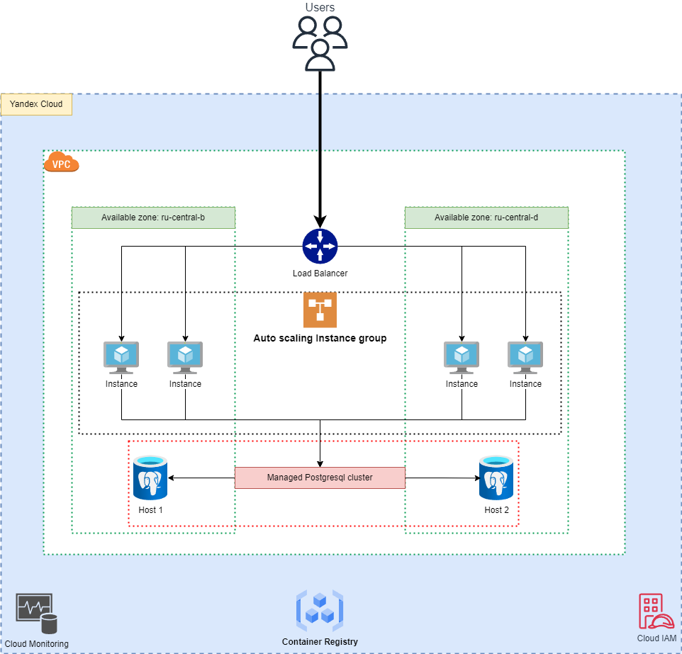
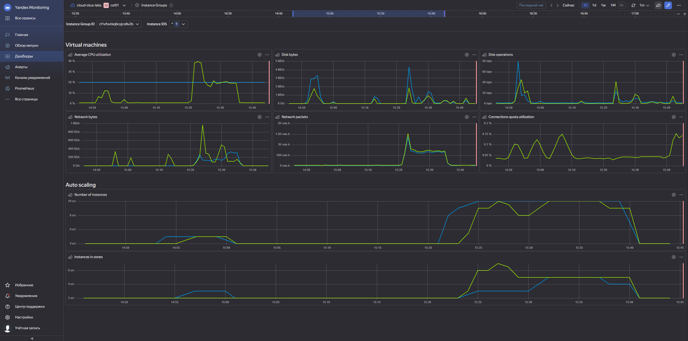
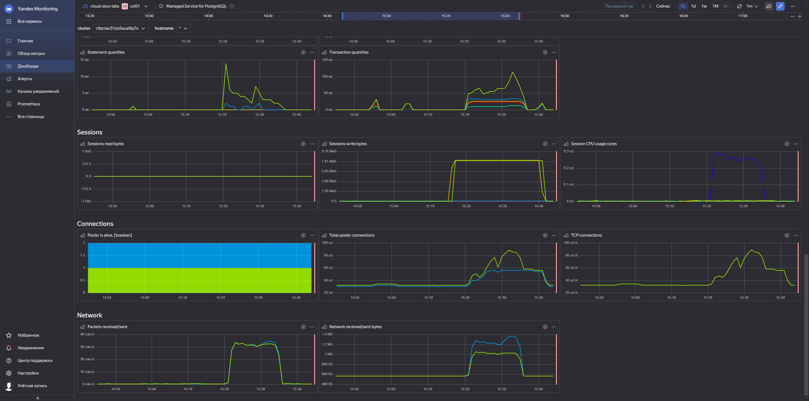
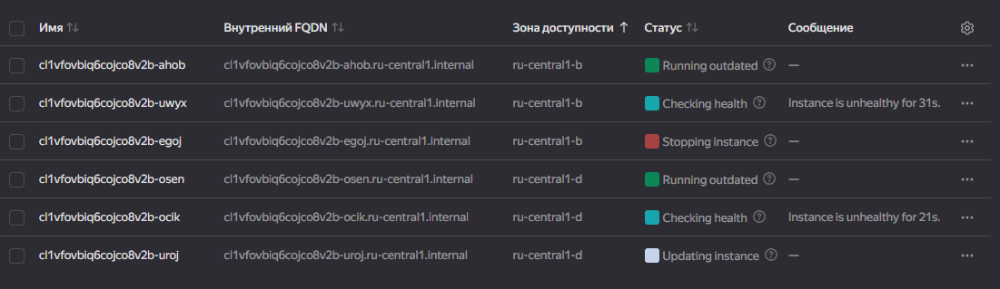
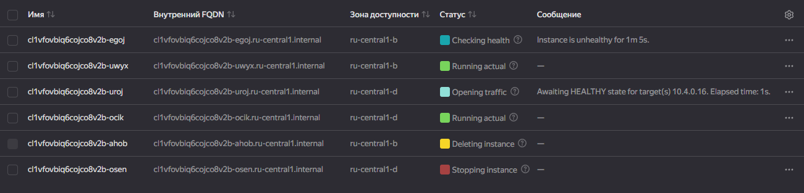
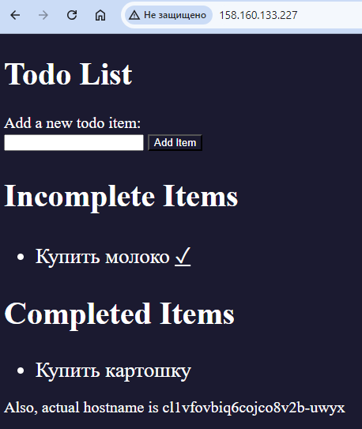

# Проектная работа. Разворачиваение приложения ToDo List в Yandex.Cloud

# Архитектурная схема


## Описание Кейса
### Введение
В современном мире управление временем и задачами является ключевым фактором для повышения продуктивности и эффективности как индивидуальных сотрудников, так и целых команд. <br>
Внедрение приложения ToDo List может существенно помочь в этом направлении.

### Цель
Цель данного бизнес кейса — обосновать необходимость развертывания приложения ToDo List в компании, описать предполагаемые выгоды, оценить затраты и риски, а также предложить план реализации.

### Проблемы и возможности
**Проблемы:**

- Сложность в управлении задачами и проектами.
- Отсутствие централизованного инструмента для отслеживания прогресса.
- Трудности в приоритизации задач.
- Потеря времени из-за недостаточной координации между членами команды.
- 
**Возможности:**

- Улучшение управления временем и задачами.
- Повышение прозрачности и ответственности в команде.
- Увеличение продуктивности за счет более эффективного планирования.
- Улучшение коммуникации и координации между сотрудниками.

### Целевая аудитория
Основными пользователями приложения будут все сотрудники компании, включая менеджеров проектов, командных лидеров и рядовых сотрудников, которым необходимо организовывать свои рабочие задачи.

### Ожидаемые выгоды
**Качественные выгоды:**

- Улучшение организации работы и времени.
- Повышение уровня ответственности и мотивации сотрудников.
- Снижение уровня стресса благодаря ясности задач и сроков.

**Количественные выгоды:**

- Сокращение времени на координацию задач до 20%.
- Увеличение продуктивности сотрудников на 15-20%.
- Снижение количества пропущенных дедлайнов на 30%.

### Затраты

- Затраты на инфраструктуру: 47000

### Заключение
Развертывание приложения ToDo List представляет собой стратегическое вложение в повышение продуктивности и эффективности работы компании. <br>
Ожидаемые выгоды значительно превышают предполагаемые затраты, что делает этот проект высоко привлекательным с точки зрения бизнеса.

---

## Подготовка IAM
Для начала создадим все необходимые учетные записи:
- Cloud admin - учетная запись с административными права на облако
- Folder admin - учетная запись с административными правами на folder, где будет развернуто приложение
- Учетная запись сетевых инженеров. Для доступа к настройкам сети в folder
- Учетная запись для сис админов. Для доступа к IG ВМ, где будет развернуто приложение
- Учетная запись для работы с PostgreSQL
- Учетная запись для работы с Container Registry

```terraform
resource "yandex_iam_service_account" "todo_cloud_sa" {
  name        = "${var.user}-todo-cloud-sa"
  description = "service account to manage cloud"
}

resource "yandex_resourcemanager_cloud_iam_binding" "cloud_admin" {
  cloud_id   = "${var.cloud_id}"
  role = "admin"
  members = [
    "serviceAccount:${yandex_iam_service_account.todo_cloud_sa.id}",
  ]
  sleep_after = 10
}

resource "yandex_iam_service_account" "todo_folder_sa" {
  name        = "${var.user}-todo-folder-sa"
  description = "service account to manage folder"
}

resource "yandex_resourcemanager_folder_iam_binding" "folder_admin" {
  folder_id   = "${var.folder_id}"
  role = "admin"
  members = [
    "serviceAccount:${yandex_iam_service_account.todo_folder_sa.id}",
  ]
  sleep_after = 10
}

resource "yandex_iam_service_account" "todo_vpc_sa" {
  name        = "${var.user}-todo-vpc-sa"
  description = "service account for vpc admins"
}

resource "yandex_resourcemanager_folder_iam_binding" "vpc_admin" {
  folder_id   = "${var.folder_id}"
  role = "admin"
  members = [
    "serviceAccount:${yandex_iam_service_account.todo_vpc_sa.id}",
  ]
  sleep_after = 10
}

resource "yandex_iam_service_account" "todo_ig_sa" {
  name        = "${var.user}-todo-ig-sa"
  description = "service account to manage IG"
}

resource "yandex_resourcemanager_folder_iam_binding" "folder_editor" {
  folder_id   = "${var.folder_id}"
  role = "editor"
  members = [
    "serviceAccount:${yandex_iam_service_account.todo_ig_sa.id}",
  ]
  sleep_after = 10
}

resource "yandex_iam_service_account" "todo_node_sa" {
  name        = "${var.user}-todo-node-sa"
  description = "service account to manage docker images on nodes"
}

resource "yandex_resourcemanager_folder_iam_binding" "folder_puller" {
  folder_id   = "${var.folder_id}"
  role = "container-registry.images.puller"
  members = [
    "serviceAccount:${yandex_iam_service_account.todo_node_sa.id}",
  ]
}
```

## Подготовка сетевой инфраструктуры
На базе одного folder в разных зонах доступности будет существовать 2 VPC с отдельными subnet.<br>
Все ресурсы будут распределены между 2мя этими сетями для отказоустойчивости.<br>
В качестве зон доступности выбраны:
- ru-central1-b
- ru-central1-d
```terraform
#---Network

resource "yandex_vpc_network" "todo-network" {
  name = "todo-network"
}

resource "yandex_vpc_subnet" "todo-subnet-b" {
  name = "todo-subnet-b"
  v4_cidr_blocks = ["10.3.0.0/16"]
  zone           = "ru-central1-b"
  network_id     = "${yandex_vpc_network.todo-network.id}"
}

resource "yandex_vpc_subnet" "todo-subnet-d" {
  name = "todo-subnet-d"
  v4_cidr_blocks = ["10.4.0.0/16"]
  zone           = "ru-central1-d"
  network_id     = "${yandex_vpc_network.todo-network.id}"
}
```

## Подготовка Кластера PostgreSQL
Развернем managed cluster PostgreSQL в 2х созданных ранее зонах доступности.<br>
На начальном этапе по 1 хосту в каждой зоне. Итого: 2 хоста.<br>
Поскольку у нас не большое приложение и не требует больших ресурсов, мы развернемся на экземплярах s2.small, которые в будущем можно увеличить.

```terraform
#---Database

locals {
  dbuser     = tolist(yandex_mdb_postgresql_cluster.todo_postgresql.user.*.name)[0]
  dbpassword = tolist(yandex_mdb_postgresql_cluster.todo_postgresql.user.*.password)[0]
  dbhosts    = yandex_mdb_postgresql_cluster.todo_postgresql.host.*.fqdn
  dbname     = tolist(yandex_mdb_postgresql_cluster.todo_postgresql.database.*.name)[0]
}

resource "yandex_mdb_postgresql_cluster" "todo_postgresql" {
  name        = "todo-postgresql"
  folder_id   = var.folder_id
  environment = "PRODUCTION"
  network_id  = yandex_vpc_network.todo-network.id

  config {
    version = 12
    resources {
      resource_preset_id = "s2.small"
      disk_type_id       = "network-ssd"
      disk_size          = 10
    }
  }

  database {
    name  = var.postgre_dbname
    owner = var.postgre_owner
  }

  user {
    name     = var.postgre_user
    password = var.postgre_password
    permission {
      database_name = var.postgre_dbname
    }
  }

  host {
    zone             = "ru-central1-b"
    subnet_id        = yandex_vpc_subnet.todo-subnet-b.id
    assign_public_ip = true
  }
  host {
    zone             = "ru-central1-d"
    subnet_id        = yandex_vpc_subnet.todo-subnet-d.id
    assign_public_ip = true
  }
}
```

## Подготовка Container Registry
Создадим новый Container Registry.
```terraform
#---Container Registry

resource "yandex_container_registry" "todo_registry" {
  name = "todo-registry"
  folder_id = var.folder_id
}
```
Затем соберем образ нашего приложения. DockerFile:
```bash
FROM python:3.7-slim-buster

WORKDIR /usr/src/app

RUN apt-get update && apt-get install -y gcc libpq-dev
RUN pip install --no-cache-dir flask flask_sqlalchemy psycopg2

COPY . .

ARG COLOR_SCHEME=light
ENV COLOR_SCHEME "$COLOR_SCHEME"
CMD ["python", "./app.py"]
```

```bash
docker build . --tag cr.yandex/<идентификатор_реестра>/todo-project:v1 --platform linux/amd64
```
Загрузим Docker-образ в Container Registry:

```bash
docker push cr.yandex/<идентификатор_реестра>/todo-project:v1
```

## Подготовка Instance Group

Разместим ВМ для проекта в Instance Group. <br>
С помощью Instance Groups мы можем:
- Одновременно обновлять все виртуальные машины в группе
- Интегрироваться с сервисами Yandex Network Load Balancer и Yandex Application Load Balancer и равномерно распределять нагрузку между виртуальными машинами.
- Создавать автоматически масштабируемые группы виртуальных машин
- Автоматически восстанавливать виртуальные машины в случае сбоя приложения
- Поддерживать работу служб приложений в надежной среде с многозональными функциями вместо выделения ресурсов для каждой зоны

При создании группы необходимо описать:
- Шаблон, по которому будут развертываться виртуальные машины группы.
- Политики масштабирования, развертывания и распределения.

```terraform
#---Instance Group

data "yandex_compute_image" "coi" {
  family = "container-optimized-image"
}

resource "yandex_compute_instance_group" "todo_instances" {
  name               = "todo-ig"
  folder_id          = var.folder_id
  service_account_id = yandex_iam_service_account.todo_ig_sa.id
  instance_template {
    platform_id = "standard-v2"
    resources {
      memory = 2
      cores  = 2
    }
    boot_disk {
      mode = "READ_WRITE"
      initialize_params {
        image_id = data.yandex_compute_image.coi.id
        size     = 30
      }
    }
    network_interface {
      network_id = yandex_vpc_network.todo-network.id
      nat        = "true"
    }
    service_account_id = yandex_iam_service_account.todo_node_sa.id
    metadata = {
      ssh-keys                     = "otus:${file("~/.ssh/id_ed25519.pub")}"
      docker-container-declaration = templatefile("${path.module}/files/spec.yaml", {
        docker_image   = "cr.yandex/${yandex_container_registry.todo_registry.id}/todo-project:v1"
        database_uri   = "postgresql://${local.dbuser}:${local.dbpassword}@:1/${local.dbname}"
        database_hosts = "${join(",", local.dbhosts)}"
      })
    }
  }

  scale_policy {
    auto_scale {
      initial_size = 4
      max_size = 10
      min_zone_size = 2
      cpu_utilization_target = 20
      measurement_duration = 60
      custom_rule {
        metric_name = "network_received_packets"
        metric_type = "GAUGE"
        rule_type   = "WORKLOAD"
        target      = 100
      }
    }
  }

  allocation_policy {
    zones = [
      "ru-central1-b",
      "ru-central1-d"
    ]
  }

  deploy_policy {
    max_unavailable = 2
    max_expansion   = 2
  }

  load_balancer {
    target_group_name = "tg-ig"
  }

  health_check {
    healthy_threshold   = 2
    interval            = 2
    timeout             = 1
    unhealthy_threshold = 2

    http_options {
      path = "/healthy"
      port = "80"
    }
  }

  depends_on = [
    yandex_resourcemanager_folder_iam_binding.folder_editor
  ]
}
```

В нашем случае мы создаем группу ВМ по след правилам:
- Политика распределения:
  - мы распределям группу по зонам доступности, в нашем примере это ru-central1-b и ru-central1-d.
- Политика Развертывания:
  - максимальное количество ВМ, на которое можно превысить целевой размер группы - 2
  - максимальное количество ВМ в статусе RUNNING, на которое можно уменьшить целевой размер группы - 2
- Политика масштабирования:
  - мы будем масштабироваться автоматически
  - при старте развертывания у нас будут 4 ВМ, которые будут распределены между 2 зонами доступности, согласно политики разверывания
  - для того, чтобы беречь бюджет мы ограничиванием общее кол-во ВМ, которое будет максимальным - 10
  - чтобы поддерживать отказоустойчивость, мы зададим минимальное кол-во ВМ в каждой зоне - 2
  - также, мы зададим целевой уровень нагрузки CPU, который позволяет выполнять масштабирование
  - также, используем метрику network_received_packets, которая определяет кол-во входящих запросов, чтобы масштабироваться
  - обязательно зададим промежуток измерения нагрузки, минимальное значение - 60с
- Проверка состояния:
  - зададим кол-во последовательно пройденных проверок, после которых ВМ считается здоровой - 2
  - зададим кол-во последовательно пройденных проверок, после которых ВМ считается нездоровой - 2
  - зададим интервал проверок и таймаут проверки
  - проверять будем по протоколу HTTP и отправлять проверочные запросы на 80 порт

В качестве образа для запуска ВМ используется Container Optimized Image. <br>
**Container Optimized Image** — образ виртуальной машины, оптимизированный для запуска Docker-контейнеров.

## Подготовка Network Load Balancer
Мы интегрируем нашу группу ВМ с балансировщиком.
```terraform
resource "yandex_lb_network_load_balancer" "todo_lb" {
  name = "todo-lb"

  listener {
    name = "todo-listener"
    port = 80
    external_address_spec {
      ip_version = "ipv4"
    }
  }

  attached_target_group {
    target_group_id = "${yandex_compute_instance_group.todo_instances.load_balancer.0.target_group_id}"

    healthcheck {
      name = "todo-http-hc"
      http_options {
        port = 80
        path = "/alive"
      }
    }
  }
}
```

Балансировщик будем работать на 80 порту.

## Мониторинг и тестирование

Для мониторинга производительности Instance группы создадим отдельный дашборд, на котором также добавим метрики по масштабированию.<br>
С помощью скрипта начинаем отправлять get запросы на наше приложение, тем самым генерируем нагрузку.<br>
Когда нагрузка возрастает, кол-во инстансов увеличивается, тем самым распределяя нагрузку на большее число ВМ.<br>
На графиках видно, что среднее утилизирование CPU с увеличением кол-ва ВМ снижается.<br>
Ну а когда нагрузка спадает, то уменьшается и кол-во инстансов в группе.


Со стороны DB тоже фиксируем в те же моменты обращения:


В случае, когда нагрузка возрастает выше политик автомасштабирования, то генерируется алерт для технических специалистов.<br>
Они могут через Terrafrom:
- увеличить кол-во инстансов для масштабирования
- увеличить ресурсы инстанса, в зависимости от текущей нагрузки (например, увеличить кол-во ядер CPU)

В случае, если необходимо обновить приложение, необхоимо поменять настройки шаблона ВМ в Instance группе, указав другой образ. <br>
ВМ будут последовательно перезапущены во всей группе.



Для примера обновления приложения поменяем фон.<br>
Актуальное приложение:<br>


Обновленное приложение:<br>


## Поддержка
Благодаря натроенному IAM у разных команд есть права доступа ко всей необходимой инфраструктуре. <br>
Сетевики могут донастраивать сети. <br>
При проблемах с IG или реестром ops могут изменить инфраструктуру через Terraform:
- увеличивать кол-во инстансов
- изменять контейнер с приложением
- менять текущий мастер в кластере PostgreSQL через CLI или UI